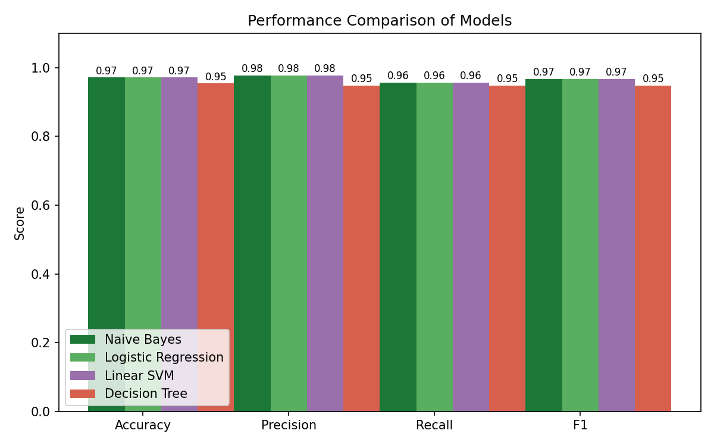

# HadiProjects

Projects I worked on during my Computer Science degree at Beirut Arab University.

## Phishing Email Detection (Machine Learning)

Built a classifier that detects phishing emails targeting bank customers.
I generated a dataset of 2,600 banking emails, cleaned the text, and used TF-IDF
plus extra features like number of links, urgent wording, and spelling mistakes.
I compared Naive Bayes with Logistic Regression, Linear SVM, and Decision Tree.
Naive Bayes reached 97.1% accuracy, had the best ROC AUC (0.97), and was the
fastest to train.

Built with Python, scikit-learn, pandas and matplotlib.

Code, data and charts: [phishing-email-detection](phishing-email-detection)
Report: [PDF](reports/ML%20Project%20-%20Phishing%20Detection%20-%20Hadi%20Muselmani.pdf)

## SAWTAK (Senior Project)

Sawtak (صوتك, "Your Voice") is a Lebanese social platform meant to make online
debate less toxic. Instead of a normal feed, users respond to posts with
Agree / Disagree, and the platform uses AI to classify posts by topic and opinion.
It has two main features: an "Echo Chamber Breaker" that recommends posts with
views different from your own, and a news verification tool that checks claims
against trusted sources and gives an evidence score from 0 to 5.
Privacy was a core rule: the platform never stores or guesses a user's religion,
sect, or political affiliation.

This first phase covered requirements, a survey of 88 Lebanese users, a feasibility
study, UI prototypes, and full system design. Team project with 4 other students.
Planned stack: React, Node.js, Supabase / PostgreSQL.

Report: [PDF](reports/SAWTAK%20Senior%20Project%20-%20Hadi%20Muselmani.pdf)

## Zero-Trust Security on Azure (Cloud Project)

Set up a zero-trust identity and access system on Microsoft Azure using Entra ID.
I created a tenant with multiple users and roles, gave each one only the access
they needed (RBAC), added Conditional Access rules for MFA and location limits,
used a Managed Identity so an Azure Function could run without stored passwords,
and wrote KQL queries in Log Analytics to spot suspicious sign-ins.

Report: [PDF](reports/Cloud%20Project%20-%20Zero%20Trust%20Azure%20-%20Hadi%20Muselmani.pdf)

## Automated Cryptanalysis of Classical Ciphers (Computer Security)

A Java program that takes ciphertext and tries to recover the message without
the key. It detects Caesar ciphers and breaks them by trying every shift and
scoring the results with common English words. For other text it runs a
frequency analysis attack for substitution ciphers and tries several column
keys for transposition ciphers.

Built with Java.

Code: [classical-cipher-cryptanalysis](classical-cipher-cryptanalysis)
Report: [PDF](reports/Security%20Project%20-%20Classical%20Cipher%20Cryptanalysis%20-%20Hadi%20Muselmani.pdf)

## Student Grade Search & Sort System (Algorithms)

A Java program where you enter students and their scores. It searches the list
with Linear Search, sorts it with Bubble Sort, searches again with Binary Search,
and then compares the algorithms by Big-O complexity and real execution time.

Built with Java.

Code: [student-grade-search-sort](student-grade-search-sort)
Report: [PDF](reports/Algorithms%20Project%20-%20Student%20Grade%20Search%20and%20Sort%20-%20Hadi%20Muselmani.pdf)

## CPU Scheduling and Banker's Algorithm (Operating Systems)

Simulated FCFS CPU scheduling with 12 processes in an OS simulator, recorded
waiting and turnaround times, and drew the Gantt chart (average waiting time
was 54.25). In the second part I used the Banker's Algorithm on 4 processes and
3 resource types to calculate the Need matrix and check if the system was in a
safe state.

Report: [PDF](reports/OS%20Project%20-%20CPU%20Scheduling%20-%20Hadi%20Muselmani.pdf)

## Contact

Portfolio: https://hadimuselmani.github.io
Email: [your email]
